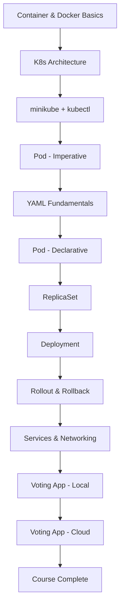

# แผนการสอน Kubernetes สำหรับผู้เริ่มต้น

> **อ้างอิงจาก:** `COURSE_CONTENT.txt`  
> **กลุ่มเป้าหมาย:** ผู้เรียนที่ไม่มีประสบการณ์ Kubernetes  
> **แนวทางการสอน:** ปฏิบัติเป็นหลัก (Hands-on First) — สอน 30% / ทำ Lab 70%

---

## 1. ภาพรวมหลักสูตร

| รายการ | รายละเอียด |
|--------|------------|
| **ระยะเวลา** | 5 วัน (40 ชั่วโมง) หรือ 10 สัปดาห์ (สัปดาห์ละ 4 ชม.) |
| **รูปแบบ** | Lecture สั้น → Demo สด → Lab ปฏิบัติ → Review & Q&A |
| **เครื่องมือหลัก** | minikube, kubectl, VS Code + Red Hat YAML extension, Code Cloud (Lab) |
| **โปรเจกต์สรุปท้ายคอร์ส** | Deploy Voting App (Microservices) บน Kubernetes ท้องถิ่นและ Cloud |

### วัตถุประสงค์การเรียนรู้ (Learning Outcomes)

เมื่อจบหลักสูตร ผู้เรียนสามารถ:

1. อธิบายแนวคิด Container, Docker และ Kubernetes Architecture ได้
2. ติดตั้งและใช้งาน minikube + kubectl ได้ด้วยตนเอง
3. สร้างและจัดการ Pod, ReplicaSet, Deployment ด้วย YAML manifest
4. ออกแบบ Service (NodePort, ClusterIP, LoadBalancer) เพื่อเชื่อมต่อแอป
5. Deploy แอป Microservices แบบ Multi-tier บน Kubernetes
6. Deploy แอปขึ้น Managed Kubernetes บน GCP (GKE), AWS (EKS), หรือ Azure (AKS)

### สิ่งที่ต้องเตรียมก่อนเรียน (Prerequisites)

- พื้นฐาน Linux command line (cd, ls, cat, grep)
- ความรู้พื้นฐาน Networking (IP, Port, DNS)
- ติดตั้ง: VirtualBox หรือ Docker Desktop, minikube, kubectl, VS Code
- สมัครบัญชี Code Cloud และ sync Udemy credentials (สำหรับ Lab ในเบราว์เซอร์)

---

## 2. โครงสร้างหลักสูตร (Course Modules)

```
Module 1: พื้นฐาน Container & K8s Architecture     [วันที่ 1]
Module 2: ติดตั้ง Cluster & Pod                      [วันที่ 1–2]
Module 3: YAML & Workload Controllers                [วันที่ 2–3]
Module 4: Networking & Services                    [วันที่ 3–4]
Module 5: Microservices & Cloud Deployment         [วันที่ 4–5]
```

---

## 3. แผนการสอนรายวัน

---

### วันที่ 1 — พื้นฐาน Container และ Kubernetes Architecture

**เป้าหมาย:** ผู้เรียนเข้าใจ "ทำไมต้องใช้ Kubernetes" และพร้อมใช้งาน Lab environment

| เวลา | หัวข้อ | กิจกรรม | อ้างอิงเนื้อหา |
|------|--------|---------|---------------|
| 09:00–09:30 | แนะนำหลักสูตร & Lab Environment | สมัคร Code Cloud, sync Udemy, ทดลองเข้า Lab | Accessing the Lab |
| 09:30–10:30 | Containers Overview | บรรยาย: Image, Container, Docker run, Portability | Containers Overview |
| 10:30–10:45 | พัก | | |
| 10:45–11:30 | Container Orchestration | บรรยาย: Scaling, Load Balancing, Declarative config | Container Orchestration |
| 11:30–12:30 | Kubernetes Architecture | วาดแผนภาพ: Master/Worker, API Server, etcd, Scheduler, kubelet | Kubernetes Architecture |
| 12:30–13:30 | พักกลางวัน | | |
| 13:30–14:15 | Docker vs containerd & CRI | บรรยาย: CRI, OCI, nerdctl, crictl — เน้น debugging runtime | Docker-vs-ContainerD |
| 14:15–14:30 | หมายเหตุ Docker Deprecation | อธิบายว่า Docker ยังใช้ dev ได้ แต่ K8s ใช้ containerd | A note on Docker deprecation |
| 14:30–15:30 | **Lab 1:** Minikube Setup | ติดตั้ง minikube + kubectl, deploy hello-minikube, expose & test | Demo - Minikube-Setup |
| 15:30–16:00 | Review & Q&A | สรุปคำสั่ง kubectl พื้นฐาน | |

**คำสั่งที่ต้องฝึกในวันนี้:**
```bash
minikube start
kubectl get nodes
kubectl cluster-info
kubectl create deployment hello-minikube --image=k8s.gcr.io/echoserver:1.4
kubectl expose deployment hello-minikube --type=NodePort --port=8080
minikube service hello-minikube --url
```

**เกณฑ์ผ่าน Lab 1:**
- [ ] Cluster status = Ready
- [ ] เข้าถึง hello-minikube ผ่าน browser ได้
- [ ] อธิบายบทบาท Master vs Worker node ได้

---

### วันที่ 2 — Pod และ YAML Fundamentals

**เป้าหมาย:** ผู้เรียนสร้าง Pod ด้วย imperative และ declarative (YAML) ได้

| เวลา | หัวข้อ | กิจกรรม | อ้างอิงเนื้อหา |
|------|--------|---------|---------------|
| 09:00–09:45 | Pods — แนวคิด | บรรยาย: 1 Pod = 1+ Container, Pod lifecycle, scaling ด้วย Pod | Pods |
| 09:45–10:30 | **Demo:** Deploy Pod ด้วย kubectl run | สร้าง nginx pod, ใช้ get/describe | Demo - Pods |
| 10:30–10:45 | พัก | | |
| 10:45–11:30 | Introduction to YAML | ฝึก YAML: key-value, list, dictionary, indentation | Introduction to YAML |
| 11:30–12:00 | Coding Exercises | ทำแบบฝึก YAML ใน Lab (แก้ไข vegetable entry) | Introduction to Coding Exercises |
| 12:00–13:00 | พักกลางวัน | | |
| 13:00–13:45 | Pods with YAML | บรรยาย: apiVersion, kind, metadata, spec | Pods with YAML |
| 13:45–14:30 | **Demo:** Pods with YAML | สร้าง pod-definition.yaml, kubectl apply | Demo - Pods with YAML |
| 14:30–15:00 | YAML Tips (VS Code) | ติดตั้ง Red Hat YAML extension, schema validation | Demo - YAML - Tips |
| 15:00–16:30 | **Lab 2:** Pods with YAML | สร้าง pod, debug image pull error, delete/apply | Solution : Pods with YAML Lab |

**Template Pod YAML ที่ใช้สอน:**
```yaml
apiVersion: v1
kind: Pod
metadata:
  name: nginx-pod
  labels:
    app: nginx
spec:
  containers:
  - name: nginx
    image: nginx:latest
    ports:
    - containerPort: 80
```

**เกณฑ์ผ่าน Lab 2:**
- [ ] สร้าง Pod จาก YAML สำเร็จ (Status = Running)
- [ ] ใช้ `kubectl describe pod` หา error ได้เมื่อ image ผิด
- [ ] ใช้ `kubectl delete -f` และ `kubectl apply -f` ได้

---

### วันที่ 3 — ReplicaSet และ Deployment

**เป้าหมาย:** ผู้เรียนจัดการ High Availability และ Rolling Update ได้

| เวลา | หัวข้อ | กิจกรรม | อ้างอิงเนื้อหา |
|------|--------|---------|---------------|
| 09:00–09:45 | Replication Controllers & ReplicaSets | บรรยาย: replicas, selector, template, self-healing | Replication Controllers and ReplicaSets |
| 09:45–10:30 | **Demo:** ReplicaSets | สร้าง ReplicaSet, scale up/down, ดู pod replacement | Demo - ReplicaSets |
| 10:30–10:45 | พัก | | |
| 10:45–12:00 | **Lab 3:** ReplicaSets | debug label mismatch, scale 5→2, observe recreation | Solution - ReplicaSets |
| 12:00–13:00 | พักกลางวัน | | |
| 13:00–13:45 | Deployments | บรรยาย: Rolling update, versioning, pause/resume | Deployments |
| 13:45–14:30 | **Demo:** Deployments | สร้าง deployment.yaml (3 replicas nginx) | Demo - Deployments |
| 14:30–15:30 | **Lab 4:** Deployments | troubleshoot, validate readiness | Solution - Deployments |
| 15:30–16:30 | Update & Rollback | บรรยาย: recreate vs rolling, rollout history/undo | Deployments - Update and Rollback |
| 16:30–17:00 | **Demo:** Rollback | เปลี่ยน image → rollback ด้วย rollout undo | Demo - Deployments - Update and Rollback |

**คำสั่งที่ต้องฝึกในวันนี้:**
```bash
kubectl scale rs <name> --replicas=5
kubectl get rs,pods --show-labels
kubectl rollout status deployment/<name>
kubectl rollout history deployment/<name>
kubectl rollout undo deployment/<name>
kubectl rollout undo deployment/<name> --to-revision=2
```

**เกณฑ์ผ่าน Lab 3–4:**
- [ ] ReplicaSet รักษา desired replicas อัตโนมัติเมื่อลบ Pod
- [ ] Deployment rolling update สำเร็จโดยไม่ downtime
- [ ] Rollback กลับ revision ก่อนหน้าได้

---

### วันที่ 4 — Networking, Services และ Microservices

**เป้าหมาย:** ผู้เรียนเชื่อมต่อแอปหลาย Pod และ deploy แอปจริง (Voting App)

| เวลา | หัวข้อ | กิจกรรม | อ้างอิงเนื้อหา |
|------|--------|---------|---------------|
| 09:00–09:30 | Basics of Networking | บรรยาย: Pod IP (10.244.0.0/16), pod-to-pod communication | Basics of Networking in Kubernetes |
| 09:30–10:15 | Services — NodePort | บรรยาย: ClusterIP, NodePort, LoadBalancer, selector | Services - NodePort |
| 10:15–11:00 | **Demo:** NodePort Service | expose 6-pod deployment, เข้าผ่าน browser | Demo - Services |
| 11:00–11:30 | Services — ClusterIP & LoadBalancer | บรรยาย use case แต่ละประเภท | Services - ClusterIP, Services - Load Balancer |
| 11:30–12:30 | **Lab 5:** Services | สร้าง web service, ตรวจ endpoints | Solution - Services |
| 12:30–13:30 | พักกลางวัน | | |
| 13:30–14:15 | Microservices Application | บรรยายสถาปัตยกรรม Voting App (Python, .NET, Node.js, Redis, Postgres) | Microservices Application |
| 14:15–15:15 | Deploying Voting App (Pods) | วางแผน manifests: voting, result, worker, redis, postgres | Deploying Voting App on Kubernetes |
| 15:15–16:30 | **Lab 6:** Voting App with Pods | apply manifests ทั้งหมด, verify connectivity | Demo - Deploying Voting App on Kubernetes |
| 16:30–17:30 | **Lab 7:** Voting App with Deployments | แปลงเป็น Deployment, scale, self-healing | Demo - Deploying Voting App on Kubernetes With Deployments |

**Service YAML Template:**
```yaml
apiVersion: v1
kind: Service
metadata:
  name: web-service
spec:
  type: NodePort
  selector:
    app: web
  ports:
  - port: 80
    targetPort: 80
    nodePort: 30080
```

**เกณฑ์ผ่าน Lab 6–7:**
- [ ] Vote ผ่าน browser ได้
- [ ] ผลโหวตแสดงใน Result UI
- [ ] ใช้ Deployment แทน Pod แล้ว self-heal เมื่อลบ pod

---

### วันที่ 5 — Kubernetes on Cloud & สรุปหลักสูตร

**เป้าหมาย:** ผู้เรียน deploy แอปขึ้น Managed Kubernetes บน Cloud ได้

| เวลา | หัวข้อ | กิจกรรม | อ้างอิงเนื้อหา |
|------|--------|---------|---------------|
| 09:00–09:30 | Kubernetes on Cloud — Introduction | เปรียบเทียบ self-hosted vs managed (GKE, EKS, AKS) | Kubernetes on Cloud - Introduction |
| 09:30–11:00 | **Lab 8a:** GKE (GCP) | สร้าง cluster, configure kubectl, deploy voting app, LoadBalancer | Kubernetes on GCP (GKE) |
| 11:00–11:15 | พัก | | |
| 11:15–12:30 | **Lab 8b:** EKS (AWS) | สร้าง cluster, node group, deploy manifests | Kubernetes on AWS (EKS) |
| 12:30–13:30 | พักกลางวัน | | |
| 13:30–15:00 | **Lab 8c:** AKS (Azure) | สร้าง AKS, service principal, deploy ด้วย Cloud Shell | Kubernetes on Azure (AKS) |
| 15:00–15:45 | Best Practices & Next Steps | ConfigMaps, Secrets, Ingress, Helm, CI/CD — แนะนำเส้นทางต่อ | Conclusion |
| 15:45–16:30 | สอบปฏิบัติ / โปรเจกต์สรุป | Deploy Voting App บน Cloud ที่เลือก ภายในเวลาที่กำหนด | |
| 16:30–17:00 | สรุป & ปิดหลักสูตร | Q&A, แจก Certificate checklist | Conclusion |

> **หมายเหตุสำหรับผู้สอน:** Lab 8 ให้ผู้เรียนเลือก Cloud ใด Cloud หนึ่ง (GKE/EKS/AKS) ตามบัญชีที่มี — สอน concept เดียวกันทั้ง 3 แพลตฟอร์ม

**เกณฑ์ผ่าน Lab 8:**
- [ ] Cluster บน Cloud สถานะ Ready
- [ ] Voting App เข้าถึงได้ผ่าน LoadBalancer URL
- [ ] ลบ resources หลัง Lab เสร็จ (cost control)

---

## 4. แผนภาพเส้นทางการเรียนรู้



---

## 5. รายการ Lab สรุป

| Lab | ชื่อ | ทักษะที่ได้ | ระยะเวลา |
|-----|------|------------|----------|
| 1 | Minikube Setup | ติดตั้ง cluster, kubectl พื้นฐาน | 1 ชม. |
| 2 | Pods with YAML | YAML manifest, debug pod | 1.5 ชม. |
| 3 | ReplicaSets | scaling, self-healing, labels | 1.5 ชม. |
| 4 | Deployments | rolling update, rollback | 2 ชม. |
| 5 | Services | NodePort, ClusterIP, endpoints | 1.5 ชม. |
| 6 | Voting App (Pods) | multi-tier deployment | 1.5 ชม. |
| 7 | Voting App (Deployments) | production-ready manifests | 1 ชม. |
| 8 | Cloud Deployment | GKE / EKS / AKS | 3 ชม. |

---

## 6. แนวทางการสอนสำหรับผู้เรียนไม่มีประสบการณ์

### หลักการสอน (Teaching Principles)

1. **Show → Do → Review** — สาธิตก่อน ให้ทำตามทันที แล้ว review ร่วมกัน
2. **Error-Driven Learning** — จงใจสร้าง error (image ผิด, label mismatch) ให้ผู้เรียน debug ด้วย `kubectl describe`
3. **YAML First** — หลัง Lab 2 ให้ใช้ YAML เป็นหลัก ลดการพึ่ง imperative commands
4. **One Concept per Lab** — ไม่รวมหลาย concept ใน Lab เดียว
5. **Real App Context** — ใช้ Voting App เป็น thread ต่อเนื่องตั้งแต่ Module 4

### สิ่งที่ผู้เรียนมักติด — เตรียมคำตอบไว้

| ปัญหา | วิธีแก้ / คำอธิบาย |
|-------|-------------------|
| `ImagePullBackOff` | ตรวจชื่อ image, network, Docker Hub access |
| Pod ไม่ Ready | `kubectl describe pod` ดู Events |
| Service ไม่เชื่อม Pod | ตรวจ selector/labels ให้ตรงกัน |
| minikube ไม่ start | ตรวจ VirtualBox/Docker driver, RAM ≥ 4GB |
| YAML syntax error | ใช้ VS Code extension, ตรวจ indentation (space ไม่ใช่ tab) |

### คำสั่ง kubectl ที่ต้องจำ (Cheat Sheet)

```bash
# ดู resources
kubectl get pods|deployments|services|rs -o wide
kubectl describe <resource> <name>
kubectl logs <pod-name>

# จัดการ resources
kubectl apply -f <file.yaml>
kubectl delete -f <file.yaml>
kubectl edit <resource> <name>

# Scaling & Rollout
kubectl scale deployment <name> --replicas=<n>
kubectl rollout status/history/undo deployment/<name>

# Debug
kubectl exec -it <pod> -- /bin/sh
kubectl port-forward <pod> 8080:80
```

---

## 7. การประเมินผล

| วิธีประเมิน | น้ำหนัก | เกณฑ์ |
|------------|--------|-------|
| Lab Exercises (1–7) | 50% | ผ่าน checklist แต่ละ Lab |
| Cloud Deployment Project (Lab 8) | 30% | Voting App ทำงานบน Cloud |
| Quiz ท้าย Module (optional) | 20% | คะแนน ≥ 70% |

### โปรเจกต์สรุปท้ายคอร์ส

**โจทย์:** Deploy Voting App บน Managed Kubernetes (เลือก GKE, EKS หรือ AKS)

**Deliverables:**
1. YAML manifests ทั้งหมด (Deployment + Service)
2. Screenshot แอปทำงานผ่าน LoadBalancer URL
3. คำตอบสั้น ๆ 3 ข้อ:
   - Pod กับ Deployment ต่างกันอย่างไร?
   - Service แบบ NodePort กับ LoadBalancer ใช้เมื่อไหร่?
   - จะ rollback deployment อย่างไร?

---

## 8. เอกสารและทรัพยากรเสริม

| ทรัพยากร | URL |
|----------|-----|
| Kubernetes Official Docs | https://kubernetes.io/docs/ |
| kubectl Cheat Sheet | https://kubernetes.io/docs/reference/kubectl/cheatsheet/ |
| minikube Docs | https://minikube.sigs.k8s.io/docs/ |
| Voting App Source | https://github.com/dockersamples/example-voting-app |
| YAML Validator (VS Code) | Red Hat YAML extension |

---

## 9. ภาคผนวก — โครงสร้างไฟล์สำหรับ Lab

แนะนำให้ผู้เรียนจัดโฟลเดอร์ดังนี้:

```
k8s-labs/
├── 01-minikube/
├── 02-pods/
│   └── nginx-pod.yaml
├── 03-replicasets/
│   └── nginx-rs.yaml
├── 04-deployments/
│   └── nginx-deployment.yaml
├── 05-services/
│   └── web-service.yaml
└── 06-voting-app/
    ├── voting-deployment.yaml
    ├── voting-service.yaml
    ├── result-deployment.yaml
    ├── result-service.yaml
    ├── worker-deployment.yaml
    ├── redis-deployment.yaml
    ├── redis-service.yaml
    ├── postgres-deployment.yaml
    └── postgres-service.yaml
```

---

*จัดทำโดย: DevOps Engineering Team*  
*อ้างอิงเนื้อหาจาก: COURSE_CONTENT.txt*  
*เวอร์ชัน: 1.0 | วันที่: 17 กรกฎาคม 2026*
