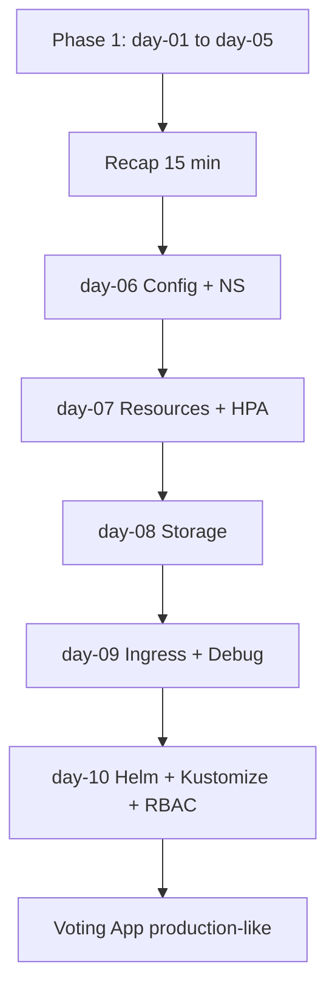

# แผนการสอน Kubernetes Phase 2 — ใช้งานจริงในงาน

> **อ้างอิงจาก:** `COURSE_CONTENT_2.txt` (เนื้อหา CKA/KodeKloud — คัดเฉพาะที่ใช้ในงาน)  
> **ต่อจาก:** `TEACHING_PLAN.md` + `COURSE_CONTENT_1.txt` (day-01 … day-05)  
> **กลุ่มเป้าหมาย:** ผู้เรียนที่ deploy Voting App / minikube / Cloud ได้แล้ว  
> **เป้าหมาย:** ทำงานกับ cluster จริงได้ — **ไม่เน้นสอบ CKA**

---

## 1. สิ่งที่เรียนแล้ว (ทบทวนสั้น ๆ ไม่สอนซ้ำ)

| หัวข้อ | ที่เรียนแล้ว | Phase 2 ทำอย่างไร |
|--------|-------------|-------------------|
| Architecture, containerd, minikube | Day 1 | อ้างอิงเมื่อ debug — ไม่ lab etcd/kubeadm |
| Pod, YAML, RS, Deployment, rollout | Day 2–3 | ใช้เป็น baseline ของทุก lab |
| Service, Voting App, HPA แนะนำ | Day 4 + `vote-hpa.yaml` | ขยาย Config/Secret, Ingress, PVC |
| Cloud GKE/EKS/AKS | Day 5 | ใช้ concept เดียวกันกับ Ingress/LB |
| Labels & selectors | Day 3–4 | ทบทวน 5 นาที → ใช้กับ NetworkPolicy |
| Imperative vs declarative | Day 2–3 | เน้น `kubectl apply` + Kustomize |

---

## 2. สิ่งใหม่จาก COURSE_CONTENT_2 (คัดเฉพาะงาน DevOps / Platform)

| หมวดใน COURSE_CONTENT_2 | รวมใน Phase 2 | ข้าม / แค่กล่าวถึง |
|-------------------------|---------------|-------------------|
| Namespaces | Day 6 | — |
| ConfigMaps & Secrets | Day 6 | encrypt-at-rest (awareness) |
| Resource requests/limits | Day 7 | LimitRange/Quota สั้น ๆ |
| Probes & lifecycle | Day 7 | — |
| HPA + metrics-server | Day 7 | VPA, in-place resize |
| Logs & `kubectl top` | Day 7 | Prometheus setup |
| PV / PVC / StorageClass | Day 8 | CSI deep dive |
| Ingress + DNS | Day 9 | Gateway API (optional read) |
| Troubleshooting apps | Day 9 | control plane static pod repair |
| RBAC (Role/RoleBinding) | Day 10 | CSR, TLS สร้าง cert เอง |
| Network Policy | Day 10 | ตัวอย่างง่าย |
| Helm | Day 10 | — |
| Kustomize overlays | Day 10 | Components ขั้นสูง |
| Scheduling: taints, affinity, daemonset | Day 7 (สั้น) | manual scheduler, multi-scheduler |
| Admission webhooks | — | รู้ว่ามี |
| Cluster upgrade, etcd backup | — | งาน SRE เฉพาะทาง |
| Mock exam / CKA tips | — | ไม่รวม |

---

## 3. ภาพรวม Phase 2

| รายการ | รายละเอียด |
|--------|------------|
| **ระยะเวลา** | 5 วัน × ~4–5 ชม. (หรือ 10 สัปดาห์ สัปดาห์ละ 2–3 ชม.) |
| **รูปแบบ** | ทบทวน 10–15 นาที → concept ใหม่ → lab บน minikube → ผูกกับ Voting App |
| **เครื่องมือ** | minikube, kubectl, Helm 3, Kustomize, metrics-server addon |
| **โปรเจกต์สรุป** | Voting App แบบ “พร้อม dev team”: namespace, config/secret, PVC, Ingress, HPA, RBAC แยก dev |

### Learning Outcomes

1. แยก environment ด้วย **Namespace** และ inject config ด้วย **ConfigMap/Secret**
2. ตั้ง **requests/limits** และ **probes** ให้ Deployment ไม่ล้มเงียบ ๆ
3. เปิด **metrics-server** และใช้ **HPA** ตามโหลดจริง
4. เก็บข้อมูล DB ด้วย **PVC** (เข้าใจ dynamic provisioning)
5. เปิดแอปด้วย **Ingress** แทน NodePort หลายตัว
6. **Troubleshoot** แอปสองชั้น (Service/DNS/port/endpoints)
7. Deploy ด้วย **Helm** และจัด env ด้วย **Kustomize**
8. ให้สิทธิ dev ใน namespace ด้วย **RBAC** พื้นฐาน

---

## 4. โครงสร้าง Module

```
Module 6 (day-06): Configuration & Isolation     — Namespaces, ConfigMaps, Secrets
Module 7 (day-07): Production-ish Workloads      — Resources, Probes, HPA, Logs
Module 8 (day-08): Persistent Storage              — PV, PVC, StorageClass
Module 9 (day-09): Exposure & Debug                — Ingress, DNS, Troubleshooting
Module 10 (day-10): Delivery & Access Control    — Helm, Kustomize, RBAC, NetPol
```

---

## 5. แผนรายวัน (สรุป)

### วันที่ 6 — day-06

| หัวข้อ | Lab | อ้างอิง COURSE_CONTENT_2 |
|--------|-----|-------------------------|
| ทบทวน Deployment + Service | — | Recap Deployments/Services |
| Namespaces | Lab 9 | Namespaces |
| ConfigMaps (env + file) | Lab 9 | Configuring ConfigMaps |
| Secrets (env, ไม่ commit ค่าจริง) | Lab 9 | Secrets |
| ผูกกับ vote/result/db | Lab 9 | Application Configuration |

### วันที่ 7 — day-07

| หัวข้อ | Lab | อ้างอิง |
|--------|-----|--------|
| requests/limits, OOMKilled | Lab 10 | Resource Requirements |
| liveness/readiness | Lab 10 | Application Lifecycle |
| metrics-server + `kubectl top` | Lab 11 | Monitor Cluster Components |
| HPA (ขยายจาก day-04) | Lab 11 | Horizontal Pod Autoscaler |
| logs multi-container | Lab 11 | Managing Application Logs |
| สั้น: taints / DaemonSet use case | อ่าน | Taints, DaemonSets |

### วันที่ 8 — day-08

| หัวข้อ | Lab | อ้างอิง |
|--------|-----|--------|
| ทำไม emptyDir ไม่พอสำหรับ Postgres | — | Volumes |
| PV + PVC + mount ใน Pod | Lab 12 | Persistent Volumes, PVC |
| StorageClass (minikube default) | Lab 12 | Storage Class |

### วันที่ 9 — day-09

| หัวข้อ | Lab | อ้างอิง |
|--------|-----|--------|
| Cluster DNS (`svc.cluster.local`) | ทบทวน | DNS in kubernetes |
| Ingress controller (minikube addon) | Lab 13 | Ingress |
| path-based routing vote/result | Lab 13 | Ingress annotations |
| Troubleshooting flow | Lab 14 | Application Failure |

### วันที่ 10 — day-10

| หัวข้อ | Lab | อ้างอิง |
|--------|-----|--------|
| Helm install/upgrade/rollback | Lab 15 | Helm - Introduction |
| Kustomize base + overlay dev/prod | Lab 16 | Kustomize overlays |
| Role + RoleBinding สำหรับ dev | Lab 16 | RBAC |
| NetworkPolicy จำกัด db | Lab 16 | Network Policy |

---

## 6. แผนภาพเส้นทาง



---

## 7. รายการ Lab Phase 2

| Lab | โฟลเดอร์ | ทักษะ | เวลา |
|-----|----------|-------|------|
| 9 | day-06 | Namespace, ConfigMap, Secret | 2 ชม. |
| 10 | day-07 | limits, probes | 1.5 ชม. |
| 11 | day-07 | metrics-server, HPA, logs | 2 ชม. |
| 12 | day-08 | PVC + Postgres data | 2 ชม. |
| 13 | day-09 | Ingress | 2 ชม. |
| 14 | day-09 | Troubleshooting | 1.5 ชม. |
| 15 | day-10 | Helm | 1.5 ชม. |
| 16 | day-10 | Kustomize + RBAC + NetPol | 2.5 ชม. |

---

## 8. โปรเจกต์สรุป Phase 2

**โจทย์:** ใน namespace `voting-dev` ให้ Voting App:

1. อ่าน config จาก ConfigMap และรหัส DB จาก Secret  
2. Postgres ใช้ PVC (ข้อมูลไม่หายเมื่อ restart Pod)  
3. เข้า vote/result ผ่าน Ingress path เดียว  
4. vote มี HPA min 2 max 6  
5. สร้าง Role `voting-dev-editor` ให้ user/context ทดสอบ deploy ได้เฉพาะ namespace นี้  

**Deliverables:** โฟลเดอร์ `day-10/voting-prod-like/` (Kustomize overlay) + screenshot Ingress + `kubectl get pvc,hpa,rolebinding`

---

## 9. สิ่งที่ไม่สอน (แต่รู้ว่ามี — จาก COURSE_CONTENT_2)

- สอบ CKA, mock exam, jsonpath สำหรับข้อสอบ  
- ติดตั้ง cluster ด้วย kubeadm / upgrade minor version  
- snapshot etcd, repair static pod control plane  
- สร้าง TLS certificate ด้วย openssl ทั้ง cluster  
- เขียน Custom Controller / Operator  
- ตั้ง Validating/Mutating webhook เอง  

เมื่อทีมต้องการสิ่งเหล่านี้ → เรียนเฉพาะ module จาก KodeKloud หรือให้ Platform/SRE รับผิดชอบ

---

## 10. โครงสร้างโฟลเดอร์ repo

```
K8s/
├── TEACHING_PLAN.md              ← Phase 1
├── TEACHING_PLAN_PHASE2.md       ← เอกสารนี้
├── COURSE_CONTENT_1.txt
├── COURSE_CONTENT_2.txt
├── day-01/ … day-05/             ← เรียนแล้ว
├── day-06/ … day-10/             ← Phase 2
└── NOTE.txt
```

---

*อ้างอิงเนื้อหา: COURSE_CONTENT_2.txt | ต่อจาก TEACHING_PLAN.md v1.0*  
*เวอร์ชัน Phase 2: 1.0*
